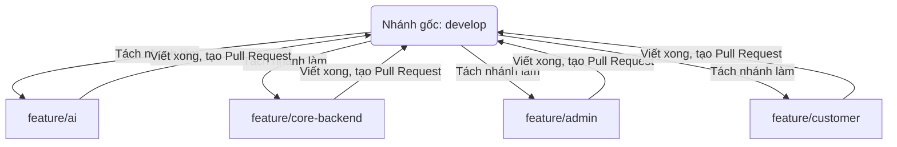

# KẾ HOẠCH PHÁT TRIỂN & QUY TẮC LÀM VIỆC DỰ ÁN

Tài liệu này hướng dẫn chi tiết nhiệm vụ của từng người trong nhóm 4 người và quy trình sử dụng Git để đảm bảo dự án chạy mượt mà, không bị xung đột code.

---

## I. Phân Công Công Việc Chi Tiết Cho 4 Thành Viên

Mô hình dự án hiện tại là **FastAPI (Python) + Jinja2 Templates (HTML/JS/CSS)**. Dưới đây là phân chia nhiệm vụ cụ thể:

### 1. Anh Quân: AI & Chatbot Specialist (Kỹ sư AI)
*   **Mục tiêu:** Xây dựng bộ não chatbot tư vấn sản phẩm thông minh bằng kỹ thuật RAG.
*   **Thư mục làm việc chính:**
    *   [Services/AI/](file:///c:/Code%20full/CURSOR-JG-DEV/Website-ban-do-cong-nghe-AI-G4-14.1-Y3/Services/AI) (Quản lý RAG, VectorStore, Groq/OpenAI Service)
    *   [Controllers/ChatController.py](file:///c:/Code%20full/CURSOR-JG-DEV/Website-ban-do-cong-nghe-AI-G4-14.1-Y3/Controllers/ChatController.py)
    *   [Models/Chat.py](file:///c:/Code%20full/CURSOR-JG-DEV/Website-ban-do-cong-nghe-AI-G4-14.1-Y3/Models/Chat.py) & [Models/AI.py](file:///c:/Code%20full/CURSOR-JG-DEV/Website-ban-do-cong-nghe-AI-G4-14.1-Y3/Models/AI.py)
*   **Nhiệm vụ cụ thể:**
    *   Cấu hình kết nối API LLM (như Groq trong [GroqService.py](file:///c:/Code%20full/CURSOR-JG-DEV/Website-ban-do-cong-nghe-AI-G4-14.1-Y3/Services/AI/GroqService.py)).
    *   Lập trình logic tìm kiếm thông tin sản phẩm liên quan từ Vector Database để trả lời khách hàng ([RAGEngine.py](file:///c:/Code%20full/CURSOR-JG-DEV/Website-ban-do-cong-nghe-AI-G4-14.1-Y3/Services/AI/RAGEngine.py)).
    *   Viết API `/api/chat` nhận câu hỏi từ người dùng và trả về câu trả lời của AI dưới dạng văn bản hoặc stream.
*   **Phụ thuộc:** Cần người làm **Core Backend** hỗ trợ thiết lập cơ sở dữ liệu lưu lịch sử chat.

---

### 2. Anh Tuấn: Core Backend & Database (Kỹ sư Hệ thống)
*   **Mục tiêu:** Xây dựng nền móng, bảo mật, quản lý luồng dữ liệu và hỗ trợ giải quyết lỗi lớn.
*   **Thư mục làm việc chính:**
    *   [Data/database.py](file:///c:/Code%20full/CURSOR-JG-DEV/Website-ban-do-cong-nghe-AI-G4-14.1-Y3/Data/database.py) (Kết nối Database)
    *   [Services/AuthService.py](file:///c:/Code%20full/CURSOR-JG-DEV/Website-ban-do-cong-nghe-AI-G4-14.1-Y3/Services/AuthService.py) (Xác thực đăng nhập/đăng ký)
    *   [Controllers/AuthController.py](file:///c:/Code%20full/CURSOR-JG-DEV/Website-ban-do-cong-nghe-AI-G4-14.1-Y3/Controllers/AuthController.py)
    *   [app.py](file:///c:/Code%20full/CURSOR-JG-DEV/Website-ban-do-cong-nghe-AI-G4-14.1-Y3/app.py) (Cấu hình chung toàn hệ thống)
*   **Nhiệm vụ cụ thể:**
    *   Tối ưu hóa cơ sở dữ liệu (SQLite hiện tại hoặc chuyển sang PostgreSQL/SQL Server nếu cần).
    *   Viết các hàm mã hóa mật khẩu, tạo Token JWT bảo mật để đăng nhập và phân quyền (Admin vs Khách hàng).
    *   Viết Middleware chặn truy cập trái phép (ví dụ khách hàng không thể vào trang Admin).
    *   Hỗ trợ cài đặt thư viện mới (`requirements.txt`) và fix các lỗi sập server, lỗi kết nối database hoặc phân quyền.
*   **Phụ thuộc:** Cần phối hợp với tất cả mọi người để thống nhất cấu trúc cơ sở dữ liệu (`Models/`).

---

### 3. Đức Hoàn: Admin Page Developer (Kỹ sư Quản trị)
*   **Mục tiêu:** Xây dựng trang quản lý dành cho chủ cửa hàng và nhân viên.
*   **Thư mục làm việc chính:**
    *   [Views/Admin/](file:///c:/Code%20full/CURSOR-JG-DEV/Website-ban-do-cong-nghe-AI-G4-14.1-Y3/Views/Admin) (Tất cả giao diện quản trị HTML)
    *   [Controllers/AdminController.py](file:///c:/Code%20full/CURSOR-JG-DEV/Website-ban-do-cong-nghe-AI-G4-14.1-Y3/Controllers/AdminController.py)
*   **Nhiệm vụ cụ thể:**
    *   Thiết kế giao diện dashboard hiển thị biểu đồ thống kê (Doanh thu, số lượng đơn hàng, sản phẩm bán chạy).
    *   Lập trình trang quản lý CRUD sản phẩm (thêm ảnh, giá, mô tả), quản lý tồn kho và nhà cung cấp.
    *   Trang xử lý đơn hàng: Nhận đơn hàng mới từ khách hàng -> Duyệt đơn -> Cập nhật trạng thái giao hàng.
    *   Làm trang cập nhật tài liệu hướng dẫn (FAQ/Product info) để nạp vào hệ thống AI Chatbot.
*   **Phụ thuộc:** Cần người làm **Core Backend** cung cấp API phân quyền Admin.

---

### 4. Mạnh Quân: Customer Page Developer (Kỹ sư Giao diện & Trải nghiệm khách hàng)
*   **Mục tiêu:** Xây dựng toàn bộ giao diện và chức năng mua sắm dành cho người tiêu dùng.
*   **Thư mục làm việc chính:**
    *   [Views/Customer/](file:///c:/Code%20full/CURSOR-JG-DEV/Website-ban-do-cong-nghe-AI-G4-14.1-Y3/Views/Customer), [Views/Home/](file:///c:/Code%20full/CURSOR-JG-DEV/Website-ban-do-cong-nghe-AI-G4-14.1-Y3/Views/Home), [Views/Products/](file:///c:/Code%20full/CURSOR-JG-DEV/Website-ban-do-cong-nghe-AI-G4-14.1-Y3/Views/Products), [Views/Cart/](file:///c:/Code%20full/CURSOR-JG-DEV/Website-ban-do-cong-nghe-AI-G4-14.1-Y3/Views/Cart)
    *   [Controllers/HomeController.py](file:///c:/Code%20full/CURSOR-JG-DEV/Website-ban-do-cong-nghe-AI-G4-14.1-Y3/Controllers/HomeController.py), [Controllers/ProductsController.py](file:///c:/Code%20full/CURSOR-JG-DEV/Website-ban-do-cong-nghe-AI-G4-14.1-Y3/Controllers/ProductsController.py), [Controllers/CartController.py](file:///c:/Code%20full/CURSOR-JG-DEV/Website-ban-do-cong-nghe-AI-G4-14.1-Y3/Controllers/CartController.py)
*   **Nhiệm vụ cụ thể:**
    *   Thiết kế trang chủ đẹp mắt, trang danh mục sản phẩm có lọc theo khoảng giá, hãng sản xuất.
    *   Xây dựng chức năng giỏ hàng (thêm sản phẩm bằng AJAX không cần tải lại trang) và trang Thanh toán (Checkout).
    *   **Tích hợp Chatbot UI:** Thiết kế nút bong bóng chat ở góc dưới màn hình. Khi bấm vào sẽ mở khung chat. Sử dụng Javascript gửi tin nhắn tới API của **Người làm AI** và hiển thị câu trả lời mượt mà.
*   **Phụ thuộc:** Cần API chat của **Người làm AI** và API xác thực mua hàng của **Người làm Core Backend**.

---

## II. Quy Tắc Sử Dụng Git Để Push Code (Quy trình chuẩn cho nhóm)

Để tránh tình trạng đè code lẫn nhau, nhóm của bạn sẽ sử dụng một nhánh chung ổn định làm gốc, ví dụ đặt tên là: `develop`.



### 1. Quy tắc đặt tên nhánh (Branch Naming)
Mỗi khi bắt đầu làm một tính năng mới, hãy tạo một nhánh mới từ `develop` theo cú pháp:
*   `feature/ten-tinh-nang`
*   *Ví dụ:* `feature/ai-rag`, `feature/login`, `feature/admin-dashboard`, `feature/cart-ui`.

---

### 2. Quy trình làm việc hàng ngày của từng thành viên (Từng bước chi tiết)

#### Bước 1: Đầu ngày làm việc - Lấy code mới nhất của cả nhóm về máy mình
Trước khi gõ bất kỳ dòng code nào, bạn phải đồng bộ hóa code trên máy của mình với server:
1.  Chuyển sang nhánh chung `develop`:
    ```bash
    git checkout develop
    ```
2.  Tải code mới nhất từ GitHub/GitLab về:
    ```bash
    git pull origin develop
    ```
3.  Chuyển về nhánh tính năng bạn đang code dở (ví dụ: `feature/cart-ui`):
    ```bash
    git checkout feature/cart-ui
    ```
4.  Gộp code mới nhất của nhóm vào nhánh của mình:
    ```bash
    git merge develop
    ```
    *Nếu có thông báo lỗi xung đột (conflict) ở bước này, hãy sửa ngay (xem hướng dẫn ở phần III) rồi mới tiếp tục code.*

#### Bước 2: Trong ngày làm việc - Tự do viết code
Lúc này bạn đang làm việc trên nhánh riêng `feature/cart-ui`, hãy code bình thường. Thỉnh thoảng hãy lưu lại (commit):
```bash
git add .
git commit -m "Thêm giao diện giỏ hàng và nút thanh toán"
```

#### Bước 3: Cuối ngày hoặc khi viết xong tính năng - Đẩy code lên Git và tạo Pull Request (PR)
1.  Đẩy nhánh của bạn lên server:
    ```bash
    git push origin feature/cart-ui
    ```
2.  Lên giao diện web của GitHub/GitLab, nhấn nút **Create Pull Request** (Yêu cầu gộp nhánh `feature/cart-ui` vào nhánh `develop`).
3.  Nhóm hoặc Leader vào kiểm tra code, nếu chạy thử thấy ổn thì bấm nút **Merge**. Nhánh `develop` lúc này sẽ có code mới của bạn.

---

## III. Cách Xử Lý Khi Gặp Lỗi Xung Đột Code (Merge Conflict)

### 1. Tại sao bị Conflict?
Khi hai người cùng sửa trên **một file** và tại **cùng một dòng code**, Git không biết nên giữ lại bản sửa của ai nên sẽ báo lỗi đỏ:
`CONFLICT (content): Merge conflict in views/home/index.html`

### 2. Cách giải quyết:
Khi Git báo lỗi conflict, trong file bị lỗi sẽ xuất hiện các ký tự đánh dấu lạ:
```html
<<<<<<< HEAD
    <button class="btn btn-primary">Mua ngay</button> (Đây là code hiện tại của bạn)
=======
    <button class="btn btn-success">Thêm vào giỏ</button> (Đây là code mới bạn vừa pull về)
>>>>>>> develop
```

**Cách sửa:**
1.  Mở file bị lỗi lên bằng công cụ code (như VS Code). VS Code sẽ bôi màu các đoạn xung đột này.
2.  Thảo luận với người cùng sửa dòng đó xem giữ lại dòng nào, hoặc gộp cả hai lại.
3.  **Xóa sạch** các dòng ký tự lạ (`<<<<<<<`, `=======`, `>>>>>>>`).
4.  Lưu file lại và chạy lệnh Git để hoàn tất gộp code:
    ```bash
    git add .
    git commit -m "Giải quyết xung đột code"
    ```
