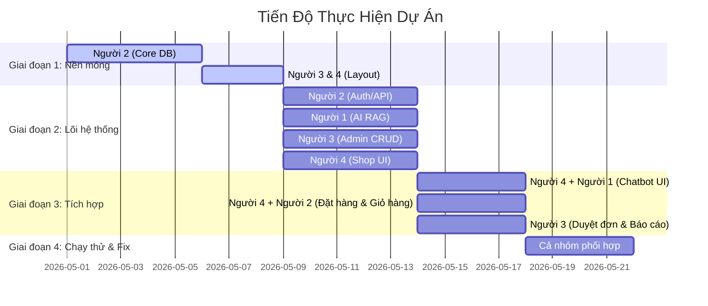

# QUY TRÌNH THỰC HIỆN DỰ ÁN 

Để dự án không bị tắc nghẽn (người này phải ngồi đợi người kia), chúng ta chia dự án thành **4 Giai đoạn** rõ ràng theo trình tự thời gian dưới đây.

---

## TỔNG QUAN TIẾN ĐỘ (ROADMAP)

---

## CHI TIẾT TỪNG GIAI ĐOẠN

### 🚀 GIAI ĐOẠN 1: THIẾT LẬP NỀN MÓNG (Móng nhà)
*Mục tiêu: Tạo cơ sở dữ liệu và khung giao diện chuẩn.*

*   **BƯỚC 1 (Người 2 - Core làm trước):**
    *   Tạo file database, thiết kế các bảng cơ sở dữ liệu (Bảng Sản phẩm, Người dùng, Giỏ hàng, Hóa đơn).
    *   *Sản phẩm đầu ra:* File [Data/database.py](file:///c:/Code%20full/CURSOR-JG-DEV/Website-ban-do-cong-nghe-AI-G4-14.1-Y3/Data/database.py) và các Models trong [Models/](file:///c:/Code%20full/CURSOR-JG-DEV/Website-ban-do-cong-nghe-AI-G4-14.1-Y3/Models) sẵn sàng.
*   **BƯỚC 2 (Người 3 & Người 4 làm sau):**
    *   Dựa trên các bảng của Người 2, Người 3 thiết lập khung giao diện Admin (`base_admin.html`), Người 4 thiết lập khung giao diện trang chủ Khách hàng (`base.html`).

---

### ⚙️ GIAI ĐOẠN 2: PHÁT TRIỂN SONG SONG (Xây tường nhà)
*Mục tiêu: Viết các tính năng cơ bản riêng biệt. Giai đoạn này 4 người có thể làm việc cùng lúc mà không cần đợi nhau.*

*   **Người 2 (Core Backend):**
    *   Viết hệ thống Đăng nhập / Đăng ký / Phân quyền. 
    *   *Đầu ra:* Các API đăng nhập sẵn sàng để Người 3 và Người 4 lắp vào giao diện.
*   **Người 1 (AI):**
    *   Viết Service kết nối với Groq/ChatGPT. 
    *   Nạp thử dữ liệu sản phẩm (dạng text) vào Vector Database để chạy thử nghiệm RAG trên Terminal.
*   **Người 3 (Admin):**
    *   Làm các trang CRUD (Thêm, Sửa, Xóa) cho Sản phẩm, Nhà cung cấp, Danh mục.
*   **Người 4 (Customer):**
    *   Làm giao diện trang chủ, trang danh sách sản phẩm, trang chi tiết sản phẩm. (Lúc này click vào nút "Mua hàng" hay "Chat" chưa có tác dụng).

---

### 🔗 GIAI ĐOẠN 3: TÍCH HỢP & GHÉP NỐI (Lắp cửa, nội thất)
*Mục tiêu: Kết nối các phần việc lại với nhau thành một website hoàn chỉnh. Đây là lúc cần sự phối hợp cao.*

*   **Kết nối Chatbot (Người 1 🤝 Người 4):**
    *   *Người 1 làm trước:* Hoàn thiện API `/api/chat` nhận tin nhắn và trả về câu trả lời.
    *   *Người 4 làm sau:* Vẽ khung chat ở góc màn hình và viết JavaScript để khi khách gõ tin nhắn, tin nhắn đó sẽ gửi qua API của Người 1 rồi hiển thị câu trả lời lên màn hình.
*   **Kết nối Giỏ hàng & Thanh toán (Người 2 🤝 Người 4):**
    *   *Người 2 làm trước:* Viết API xử lý Giỏ hàng, tạo Đơn hàng (Order), lưu vào Database.
    *   *Người 4 làm sau:* Viết giao diện Giỏ hàng, khi khách bấm "Đặt hàng" thì gọi API của Người 2 để lưu đơn hàng.
*   **Xử lý đơn hàng (Người 2 🤝 Người 3):**
    *   *Người 3 làm sau:* Vẽ trang danh sách đơn hàng cho Admin. Lấy dữ liệu đơn hàng mà Người 4 vừa tạo (qua Database của Người 2) để Admin duyệt đơn.

---

### 🔍 GIAI ĐOẠN 4: KIỂM THỬ & FIX LỖI (Dọn dẹp đón khách)
*Mục tiêu: Đảm bảo web chạy mượt và không bị lỗi.*

*   **Cả nhóm cùng tham gia:**
    *   Người 4 thử đặt hàng -> Người 3 kiểm tra xem đơn hàng có hiện ở trang Admin không.
    *   Cả nhóm hỏi xoáy đáp xoay Chatbot xem chatbot trả lời có bị lỗi không.
    *   **Người 2 (Core/Fix lỗi):** Theo dõi log hệ thống. Nếu có lỗi sập database, lỗi giỏ hàng tính sai tiền, hoặc lỗi phân quyền thì tập trung xử lý gấp.
