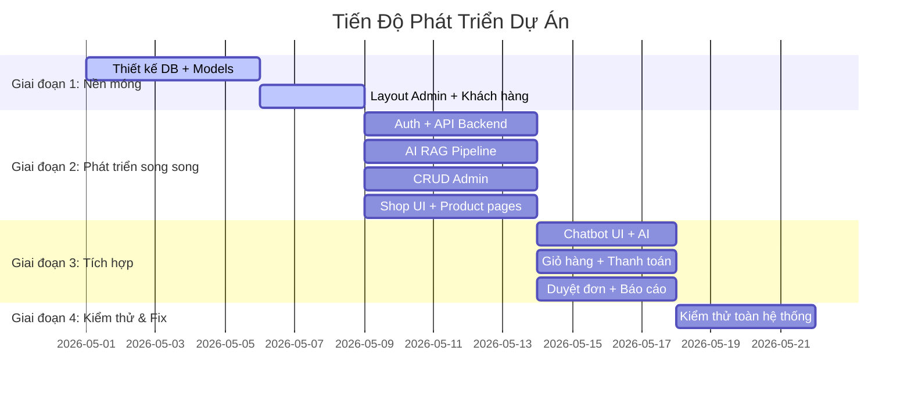
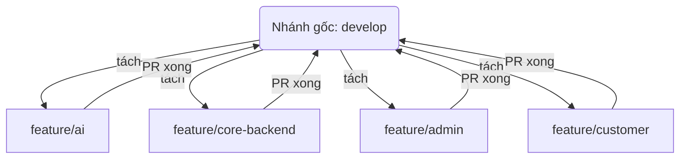

# Tech Store AI

<div align="center">

```
```

**Website Thương Mại Điện Tử Công Nghệ — Tích hợp AI Chatbot Thông Minh**

*Xây dựng trên nền tảng FastAPI + SQL Server, tích hợp AI với kỹ thuật RAG*

[](https://python.org)
[](https://fastapi.tiangolo.com)
[](https://microsoft.com/sql-server)
[](https://console.groq.com)
[](LICENSE)
[](https://github.com/TDHoan205/Website-ban-do-cong-nghe-AI-G4-14.1-Y3)

</div>

---

## Mục lục

- [Tổng quan](#tổng-quan)
- [Tính năng nổi bật](#tính-năng-nổi-bật)
- [Kiến trúc hệ thống](#kiến-trúc-hệ-thống)
- [Công nghệ sử dụng](#công-nghệ-sử-dụng)
- [Lộ trình phát triển](#lộ-trình-phát-triển)
- [Cài đặt nhanh](#cài-đặt-nhanh)
- [Tài khoản mặc định](#tài-khoản-mặc-định)
- [Cấu trúc dự án](#cấu-trúc-dự án)
- [Luồng dữ liệu](#luồng-dữ-liệu)
- [AI — RAG Pipeline](#ai--rag-pipeline)
- [Quy trình làm việc nhóm](#quy-trình-làm-việc-nhóm)
- [Giải quyết xung đột](#giải-quyết-xung-đột-code)
- [Đội ngũ phát triển](#đội-ngũ-phát-triển)
- [License](#license)

---

## Tổng quan

**Tech Store AI** là một website thương mại điện tử hoàn chỉnh, chuyên bán các sản phẩm công nghệ (điện thoại, laptop, tablet, phụ kiện), được xây dựng theo mô hình **MVC (Model–View–Controller)** với ngôn ngữ **Python** và framework **FastAPI**.

Điểm khác biệt cốt lõi: hệ thống tích hợp **AI Chatbot thông minh** sử dụng kỹ thuật **RAG (Retrieval-Augmented Generation)**, cho phép tư vấn sản phẩm bằng ngôn ngữ tự nhiên tiếng Việt, trả lời chính xác dựa trên dữ liệu thực trong cơ sở dữ liệu.

---

## Tính năng nổi bật

### Khách hàng

| Tính năng | Mô tả |
|:---|:---|
| 🛍️ **Mua sắm** | Duyệt sản phẩm, lọc theo danh mục/giá/hãng, tìm kiếm nâng cao |
| 🛒 **Giỏ hàng** | Thêm/bớt/sửa sản phẩm bằng AJAX, không tải lại trang |
| 💳 **Thanh toán** | Checkout đa bước, xác nhận đơn hàng, QR banking |
| 📦 **Đơn hàng** | Theo dõi trạng thái, xem lịch sử mua hàng |
| 🤖 **AI Chatbot** | Tư vấn sản phẩm bằng tiếng Việt tự nhiên, RAG-powered |
| 🔐 **Tài khoản** | Đăng ký / Đăng nhập / Quên mật khẩu / Quản lý hồ sơ |
| ⭐ **Đánh giá** | Xem và viết đánh giá sản phẩm |
| ❤️ **Yêu thích** | Lưu sản phẩm yêu thích |

### Quản trị (Admin / Staff)

| Tính năng | Mô tả |
|:---|:---|
| 📊 **Dashboard** | Biểu đồ doanh thu, đơn hàng, sản phẩm bán chạy |
| 📦 **Quản lý sản phẩm** | CRUD đầy đủ: thêm ảnh, giá, mô tả, tồn kho |
| 🗂️ **Quản lý danh mục** | Thêm/sửa/xóa danh mục, nhà cung cấp |
| 📋 **Xử lý đơn hàng** | Duyệt đơn → Cập nhật trạng thái giao hàng |
| 👥 **Quản lý người dùng** | Tài khoản khách hàng, nhân viên, phân quyền |
| 💰 **Tài chính** | Widget thống kê tài chính |
| 💬 **Live Chat** | Nhân viên chat trực tiếp với khách hàng |
| 🤖 **AI Chatbot** | Cấu hình và quản lý chatbot AI |

---

## Kiến trúc hệ thống

```
┌─────────────────────────────────────────────────────────────────────┐
│                           TRÌNH DUYỆT                                │
│                  (HTTP Request ←→ HTML Response)                      │
└─────────────────────────────┬─────────────────────────────────────────┘
                              │ HTTP
                              ▼
┌─────────────────────────────────────────────────────────────────────┐
│  app.py ──── FastAPI ⚡  ·  Middleware  ·  Mount /static            │
│  Routes: / · /Products/ · /Cart/ · /Orders/ · /Chat/ · /Admin/    │
└──────┬──────────────────────────┬───────────────────────────────────┘
       │                          │
       ▼                          ▼
┌──────────────────┐     ┌───────────────────────────────────────────┐
│ Controllers/     │     │               wwwroot/                     │
│                  │     │  css/   ·   js/   ·   images/            │
│ Home             │     │  CSS tùy biến + Bootstrap 5                │
│ Auth             │     │  JavaScript (AJAX, Chat widget)            │
│ Products         │     │  Ảnh sản phẩm + logo + icon              │
│ Cart             │     └───────────────────────────────────────────┘
│ Orders           │
│ Chat             │
│ Admin            │
└──────┬───────────┘
       │ gọi
       ▼
┌─────────────────────────────────────────────────────────────────────┐
│                        Services/ ⚙️                                  │
│                                                                      │
│  AuthService     │ ProductService     │ CartService                  │
│  OrderService    │ PaymentService     │ AccountService                │
│  ChatService     │ LiveChatService    │ InventoryService             │
│                                                                      │
│  ── Services/AI/ ──                                                │
│  RAGEngine      │ GroqService        │ EmbeddingService             │
│  KnowledgeService│ VectorStore       │                              │
└──────┬──────────────────────────────┬───────────────────────────────┘
       │ truy vấn                    │ gọi AI
       ▼                             ▼
┌──────────────────┐        ┌──────────────────────────────────────────┐
│   Models/ 📦     │        │              AI Layer 🤖                  │
│                  │        │                                          │
│  Product         │        │  User Query → Intent Detection             │
│  Category        │        │   ↓                                      │
│  Account/User    │        │  Vector Search (Embeddings)               │
│  Cart / Order    │        │   ↓                                      │
│  Payment         │        │  Context Retrieval                         │
│  Chat / AI       │        │   ↓                                      │
│  Inventory       │        │  Groq LLM → RAG-augmented response      │
│  Receipt         │        └──────────────────────────────────────────┘
└──────┬───────────┘
       │ SQLAlchemy 2.0
       ▼
┌─────────────────────────────────────────────────────────────────────┐
│                    SQL Server Database 🗄️                           │
│              Database: TechShopWebsite2                               │
│   16 bảng: Products · Categories · Accounts · Orders · Carts ·    │
│            ProductVariants · ProductImages · Payments · Inventory ·  │
│            ReceiptShipments · Wishlists · AIConversationLogs · ...    │
└─────────────────────────────────────────────────────────────────────┘
       │
       ▼
┌─────────────────────────────────────────────────────────────────────┐
│                         Views/ 🖼️                                    │
│              Template Engine: Jinja2 3.1.3                            │
│                                                                       │
│  Shared/base.html       → Layout chung (navbar, footer, chatbot)     │
│  Home/index.html        → Trang chủ + sản phẩm nổi bật              │
│  Products/              → index.html (danh sách), detail.html        │
│  Cart/index.html        → Giỏ hàng                                   │
│  Checkout/              → checkout · success · cancel · expired      │
│  Orders/                → index.html (lịch sử), detail.html         │
│  Auth/                  → Login · Register · Profile · ForgotPassword │
│  Chat/index.html        → Trang AI Chat lớn                          │
│  Admin/                 → Dashboard · Products · Orders · Accounts · │
│                          Categories · Statistics · LiveChat ...       │
└─────────────────────────────────────────────────────────────────────┘
```

---

## Công nghệ sử dụng

| Layer | Công nghệ | Phiên bản | Vai trò |
|:------|:-----------|:----------|:--------|
| **Backend** | FastAPI | 0.109 | Web framework, HTTP routing, ASGI |
| **Template** | Jinja2 | 3.1.3 | Server-side HTML rendering |
| **Database** | SQL Server | 2019+ | Cơ sở dữ liệu chính |
| **ORM** | SQLAlchemy | 2.0.25 | Database abstraction layer |
| **DB Driver** | pyodbc | 5.0.1 | SQL Server connectivity |
| **Auth** | python-jose + passlib | bcrypt | JWT tokens, mã hóa mật khẩu |
| **Frontend** | Bootstrap 5 + Vanilla JS | 5.3.2 | Giao diện + tương tác |
| **AI — LLM** | Groq API | — | Xử lý ngôn ngữ tự nhiên |
| **AI — Embeddings** | Google Gemini | — | Vector embedding cho RAG |
| **Server** | Uvicorn | 0.27.1 | ASGI application server |

---

## Lộ trình phát triển

Dự án được chia thành **4 giai đoạn** rõ ràng, 4 thành viên làm việc song song không phụ thuộc nhau:



### Chi tiết từng giai đoạn

| Giai đoạn | Mục tiêu | Đầu ra |
|:---|:---|:---|
| **1 — Nền móng** | Database schema + layout chung | `Data/database.py`, `Models/`, base templates |
| **2 — Phát triển song song** | Viết tính năng độc lập | API Auth, AI Chatbot, Admin CRUD, Customer UI |
| **3 — Tích hợp** | Kết nối các phần lại | Chat thực, Checkout thực, Dashboard thực |
| **4 — Kiểm thử & Fix** | Đảm bảo chạy mượt | Tất cả bug được sửa, demo hoàn chỉnh |

---

## Cài đặt nhanh

### Yêu cầu hệ thống

- Python **3.10+**
- SQL Server (Express / Developer / Standard)
- ODBC Driver 17 for SQL Server — [Tải tại đây](https://go.microsoft.com/fwlink/?linkid=2187214)
- Git

### Các bước

**1 — Clone dự án**

```bash
git clone https://github.com/TDHoan205/Website-ban-do-cong-nghe-AI-G4-14.1-Y3.git
cd Website-ban-do-cong-nghe-AI-G4-14.1-Y3
```

**2 — Cài đặt Python packages**

```bash
pip install -r requirements.txt
```

**3 — Tạo Database**

Mở **SQL Server Management Studio (SSMS)**, kết nối server và chạy lần lượt:

```sql
-- Bước 1: Tạo schema (tạo database + toàn bộ bảng)
SQL/schema.sql

-- Bước 2: Seed dữ liệu mẫu (sản phẩm, tài khoản, đơn hàng mẫu)
SQL/seed_data.sql
```

**4 — Cấu hình kết nối Database**

Mở `Data/database.py`, sửa thông tin server phù hợp:

```python
SQL_SERVER_CONFIG = {
    "server": "localhost",          # Tên SQL Server của bạn (VD: .\SQLEXPRESS)
    "database": "TechShopWebsite2", # Giữ nguyên
    "driver": "ODBC Driver 17 for SQL Server",
    "trusted_connection": "yes",     # Windows Authentication
}
```

> 💡 **Cách tìm tên server:** Mở SSMS → Nhìn ô "Server name" khi đăng nhập.

**5 — Chạy ứng dụng**

```bash
uvicorn app:app --reload --host 0.0.0.0 --port 8000
```

**6 — Mở trình duyệt**

| Trang | URL |
|:------|:----|
| 🏠 Trang chủ | http://localhost:8000 |
| 🛍️ Sản phẩm | http://localhost:8000/Products/ |
| 🛒 Giỏ hàng | http://localhost:8000/Cart/ |
| 🤖 AI Chat | http://localhost:8000/Chat/ |
| 🖥️ Admin Dashboard | http://localhost:8000/Admin/ |
| 📖 API Docs (Swagger) | http://localhost:8000/docs |

---

## Tài khoản mặc định

| Username | Password | Vai trò | Quyền truy cập |
|:---------|:---------|:--------|:----------------|
| `admin` | `admin123` | Admin | Toàn bộ hệ thống |
| `staff01` | `staff123` | Staff | Chat, duyệt đơn |
| `customer01` | `customer123` | Customer | Mua sắm, đặt hàng |

---

## Cấu trúc dự án

```
TechStoreAI/
│
├── app.py                        ⚡  FastAPI entry point
├── requirements.txt               📦  Python dependencies
├── LICENSE                       📜  MIT License
│
├── Controllers/                  🎮  Tầng HTTP — nhận request, gọi service, trả view
│   ├── HomeController.py         →  / (trang chủ)
│   ├── AuthController.py        →  /Auth/Login · /Register · /Logout
│   ├── ProductsController.py    →  /Products/ · /Products/{id}
│   ├── CartController.py        →  /Cart/ · /Cart/add · /Cart/remove
│   ├── CartItemsController.py   →  Thao tác item trong giỏ
│   ├── OrdersController.py      →  /Orders/ · /Checkout
│   ├── OrderItemsController.py  →  Chi tiết item trong đơn
│   ├── PaymentController.py     →  /Payment/ (QR banking)
│   ├── ChatController.py        →  /Chat/ · /Chat/Send
│   ├── AdminController.py       →  /Admin/ (dashboard + CRUD)
│   ├── AccountsController.py    →  /Accounts/
│   ├── CategoriesController.py  →  /Categories/
│   ├── SuppliersController.py   →  /Suppliers/
│   ├── EmployeesController.py    →  Quản lý nhân viên
│   ├── InventoryController.py   →  Quản lý kho
│   ├── ReceiptShipmentsController.py → Nhập/xuất kho
│   ├── ShopController.py        →  /Shop/
│   ├── StatisticsController.py   →  /Admin/Statistics/
│   └── SeedController.py        →  Seed dữ liệu
│
├── Services/                    ⚙️  Tầng nghiệp vụ — logic xử lý
│   ├── AuthService.py          →  JWT, bcrypt, phân quyền
│   ├── ProductService.py       →  CRUD, tìm kiếm, phân trang
│   ├── CartService.py          →  Thêm/xóa/sửa giỏ hàng
│   ├── OrderService.py         →  Tạo đơn, thống kê, trạng thái
│   ├── AccountService.py       →  Quản lý tài khoản
│   ├── ChatService.py          →  Phiên chat, lịch sử tin nhắn
│   ├── PaymentService.py        →  Xử lý thanh toán
│   ├── LiveChatService.py      →  Chat trực tiếp Admin ↔ Khách
│   └── AI/                    🤖  AI Module — RAG Pipeline
│       ├── RAGEngine.py        →  Điều phối toàn bộ luồng RAG
│       ├── GroqService.py      →  Kết nối Groq LLM API
│       ├── EmbeddingService.py →  Tạo embeddings bằng Gemini
│       ├── VectorStore.py      →  Vector database (FAISS-based)
│       └── KnowledgeService.py →  Quản lý knowledge base
│
├── Models/                      📦  Tầng dữ liệu — SQLAlchemy ORM
│   ├── Product.py               →  Products, ProductVariants, ProductImages
│   ├── Category.py             →  Categories, Suppliers
│   ├── Account.py              →  Accounts, Roles
│   ├── User.py                 →  Users
│   ├── Cart.py                 →  Carts, CartItems
│   ├── Order.py                →  Orders, OrderItems
│   ├── Payment.py              →  Payments
│   ├── Chat.py                 →  ChatSessions, ChatMessages
│   ├── AI.py                   →  AIConversationLogs
│   ├── Inventory.py            →  Inventory
│   ├── ReceiptShipment.py      →  ReceiptShipments
│   ├── Supplier.py             →  Suppliers
│   └── Wishlist.py             →  Wishlists
│
├── Views/                       🖼️  Tầng giao diện — Jinja2 HTML templates
│   ├── Shared/
│   │   ├── base.html          →  Layout chung (navbar, footer, chatbot widget)
│   │   └── error.html         →  Trang lỗi 404/500
│   ├── partials/
│   │   ├── chatbot.html       →  Widget chatbot góc màn hình
│   │   ├── admin_shell.html    →  Layout shell cho trang admin
│   │   └── footer.html        →  Footer toàn trang
│   ├── Home/index.html         →  Trang chủ
│   ├── Products/
│   │   ├── index.html         →  Danh sách sản phẩm (lọc, phân trang)
│   │   └── detail.html        →  Chi tiết sản phẩm
│   ├── Cart/index.html         →  Giỏ hàng
│   ├── Checkout/
│   │   ├── checkout.html       →  Trang thanh toán
│   │   ├── success.html        →  Thanh toán thành công
│   │   ├── cancel.html         →  Hủy thanh toán
│   │   └── expired.html        →  QR hết hạn
│   ├── Orders/
│   │   ├── index.html         →  Lịch sử đơn hàng
│   │   └── detail.html        →  Chi tiết đơn hàng
│   ├── Auth/
│   │   ├── Login.html
│   │   ├── Register.html
│   │   ├── Profile.html
│   │   ├── ForgotPassword.html
│   │   └── AdminLogin.html
│   ├── Chat/index.html         →  Trang AI Chat lớn
│   └── Admin/                   🖥️  Panel quản trị
│       ├── dashboard.html       →  Thống kê tổng quan
│       ├── products.html        →  Quản lý sản phẩm
│       ├── orders.html         →  Danh sách đơn hàng
│       ├── order_detail.html   →  Chi tiết + cập nhật đơn
│       ├── accounts.html       →  Quản lý tài khoản
│       ├── categories.html     →  Quản lý danh mục
│       ├── suppliers.html      →  Quản lý nhà cung cấp
│       ├── faqs.html          →  Câu hỏi thường gặp
│       ├── statistics.html    →  Biểu đồ doanh thu
│       ├── livechat.html      →  Live chat với khách
│       ├── chats.html         →  Lịch sử AI chat sessions
│       ├── chatbot.html       →  Cấu hình chatbot
│       └── base.html          →  Layout shell admin
│
├── Data/
│   └── database.py             🗄️  Kết nối SQL Server, SessionLocal
│
├── SQL/
│   ├── schema.sql              📋  CREATE DATABASE + 16 bảng
│   └── seed_data.sql           🌱  Dữ liệu mẫu (65 sản phẩm)
│
├── wwwroot/                     🎨  Static files
│   ├── css/
│   │   ├── style.css           →  CSS toàn trang
│   │   ├── home.css
│   │   ├── products.css
│   │   ├── cart.css
│   │   ├── checkout.css
│   │   ├── chat.css
│   │   ├── error.css
│   │   ├── auth/               →  Login, Register, Profile styles
│   │   └── admin/              →  Shell, Dashboard, CRUD styles
│   ├── js/
│   │   ├── main.js            →  AJAX, chatbot widget, cart logic
│   │   ├── admin-panel.js     →  Admin panel interactions
│   │   └── admin-chat-widget.js →  Admin live chat widget
│   └── images/
│       ├── products/           →  200+ ảnh sản phẩm
│       ├── cat_*.png          →  Ảnh danh mục
│       └── no-image.png       →  Ảnh placeholder
│
├── Utilities/                   🔧  Helper functions
│   ├── PagedList.py            →  Phân trang
│   ├── http.py                 →  HTTP response helpers
│   └── auth.py                 →  JWT decode helpers
│
├── Scripts/                    🛠️  Utility scripts
│   ├── test_intent.py          →  Test AI intent detection
│   ├── test_ai_keys.py         →  Test API keys
│   ├── test_rag_trace.py       →  Trace RAG pipeline
│   ├── seed_embeddings.py      →  Seed vector embeddings
│   └── generate_chapter2_docx.py
│
└── docs/                       📄  Tài liệu bổ sung
    ├── cấu trúc .txt
    └── CHƯƠNG_III_KET_QUA_THUC_NGHIEM.md
```

---

## Luồng dữ liệu

Luồng xử lý khi khách hàng xem danh sách sản phẩm:

```
① Khách gõ:       http://localhost:8000/Products/
② FastAPI route:  → ProductsController.index()
③ Controller:     → ProductService.get_all_products(page=1, category_id=...)
④ SQLAlchemy:     SELECT * FROM Products WHERE is_available = 1 ...
⑤ Database:       Trả về danh sách Product objects
⑥ Service:        [iPhone15, SamsungS24, MacBookAir, ...]
⑦ Controller:     TemplateResponse("Products/index.html", context)
⑧ Jinja2 render:  <div class="card">{{ p.name }}</div> 
⑨ Browser:        HTML + CSS + hình ảnh sản phẩm hiển thị
```

---

## AI — RAG Pipeline

Hệ thống chatbot AI sử dụng kỹ thuật **Retrieval-Augmented Generation (RAG)** để đảm bảo câu trả lời chính xác từ dữ liệu thực.

### Luồng xử lý

```
┌──────────────┐
│  User Query  │  "Cho tôi xin gợi ý laptop giá dưới 30 triệu"
└──────┬───────┘
       │
       ▼
┌──────────────────────────────────────────────────────────────────┐
│                     Intent Detection                               │
│  buy_intent │ product_query │ price_query │ availability_query   │
│  comparison │ recommendation │ greeting │ other                  │
└──────────────────────────────┬───────────────────────────────────┘
                                │
                                ▼
┌──────────────────────────────────────────────────────────────────┐
│                    Context Retrieval (RAG)                         │
│                                                                   │
│  1. Embedding: query → vector (Gemini embeddings)                 │
│  2. Vector Search: cosine similarity trên product embeddings     │
│  3. Keyword Fallback: nếu vector search không đủ kết quả        │
│  4. Result: Top-K sản phẩm liên quan nhất                       │
└──────────────────────────────┬───────────────────────────────────┘
                                │
                                ▼
┌──────────────────────────────────────────────────────────────────┐
│                      Groq LLM (LLM inference)                     │
│                                                                   │
│  System prompt (tech store context)                               │
│  + Retrieved product context                                      │
│  + User query                                                     │
│  → Natural language response tiếng Việt                         │
└──────────────────────────────┬───────────────────────────────────┘
                                │
                                ▼
┌──────────────┐
│   Response    │  "Dựa trên nhu cầu của bạn, tôi gợi ý..."
└──────────────┘
```

### Intent Detection

| Intent | Ví dụ câu hỏi |
|:-------|:---------------|
| `buy_intent` | "Tôi muốn mua điện thoại", "Cho tôi con nào tốt nhất" |
| `product_query` | "iPhone 15 Pro Max có gì?", "MacBook cấu hình ra sao?" |
| `price_query` | "Giá bao nhiêu?", "Có khuyến mãi gì không?" |
| `comparison` | "So sánh iPhone và Samsung", "MacBook vs Dell cái nào tốt hơn?" |
| `recommendation` | "Gợi ý laptop cho sinh viên", "Điện thoại dưới 20 triệu" |
| `availability_query` | "Còn hàng không?", "Sản phẩm nào còn bán?" |
| `greeting` | "Xin chào", "Chào bạn" |

### Cấu hình API Keys

Tạo file `.env` tại thư mục gốc:

```env
GROQ_API_KEY=your_groq_api_key_here
GEMINI_API_KEY=your_gemini_api_key_here
```

---

## Quy trình làm việc nhóm

Mỗi thành viên làm việc trên **nhánh riêng** tách từ `develop`, sau khi xong tạo **Pull Request (PR)** để gộp vào nhánh chung.

### Mô hình Git



### Đặt tên nhánh

```bash
feature/ai-rag
feature/auth-backend
feature/admin-dashboard
feature/cart-ui
```

### Quy trình hàng ngày

```bash
# ── Đầu ngày: Lấy code mới nhất ──
git checkout develop
git pull origin develop
git checkout feature/your-feature
git merge develop        # Gộp code mới nhất vào nhánh của mình

# ── Trong ngày: Code bình thường ──
git add .
git commit -m "Mô tả ngắn gọn tính năng vừa làm"

# ── Cuối ngày: Đẩy code lên ──
git push origin feature/your-feature
# → Lên GitHub tạo Pull Request vào nhánh develop
```

---

## Giải quyết xung đột code

Khi Git báo conflict ở một file, mở file đó và tìm các ký hiệu đánh dấu:

```html
<<<<<<< HEAD
    <button class="btn-primary">Mua ngay</button>   ← Code hiện tại của bạn
=======
    <button class="btn-success">Thêm vào giỏ</button> ← Code từ nhánh khác
>>>>>>> develop
```

**Cách xử lý:**
1. Thảo luận với người cùng sửa — quyết định giữ dòng nào hoặc gộp cả hai.
2. Xóa **toàn bộ** các ký hiệu conflict (`<<<<<<<`, `=======`, `>>>>>>>`).
3. Lưu file và commit:

```bash
git add .
git commit -m "Giải quyết xung đột code"
```

---

## Đội ngũ phát triển

| Thành viên | Vai trò | Phụ trách |
|:-----------|:--------|:----------|
| **Anh Quân** | AI & Chatbot Specialist | RAG Pipeline · Groq Integration · Intent Detection |
| **Anh Tuấn** | Core Backend & Database | Database Schema · Auth/JWT · API Infrastructure |
| **Đức Hoàn** | Admin Page Developer | Dashboard · CRUD Admin · Duyệt đơn hàng |
| **Mạnh Quân** | Customer Page Developer | Shop UI · Giỏ hàng · Checkout · Chatbot Widget |

### Phân công chi tiết

| Người | Folder chính | Nhiệm vụ cụ thể |
|:------|:-------------|:-----------------|
| Quân (AI) | `Services/AI/` · `Controllers/ChatController.py` · `Models/Chat.py` · `Models/AI.py` | RAG Engine, GroqService, EmbeddingService, VectorStore, `/api/chat` endpoint |
| Tuấn (Core) | `Data/database.py` · `Services/AuthService.py` · `Controllers/AuthController.py` · `app.py` | SQLAlchemy, JWT/bcrypt, Middleware bảo mật, Route đăng ký |
| Hoàn (Admin) | `Views/Admin/` · `Controllers/AdminController.py` | Dashboard, CRUD Sản phẩm, Xử lý đơn, Thống kê, Live Chat |
| Quân (Customer) | `Views/Home/` · `Views/Products/` · `Views/Cart/` · `Controllers/` | Trang chủ, Danh sách SP, Chi tiết SP, Giỏ hàng, Checkout, Widget Chat |

---

## License

MIT License — Copyright © 2026 [TDHoan205](https://github.com/TDHoan205)

> Dự án được xây dựng cho mục đích học tập và phát triển kỹ năng lập trình. mọi chi tiết xin liên hệ qua GitHub Issues.
